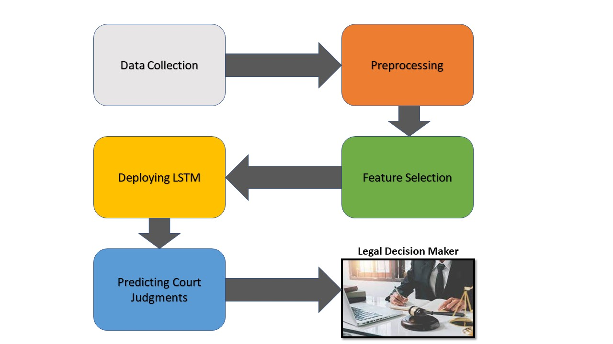
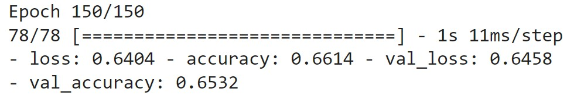
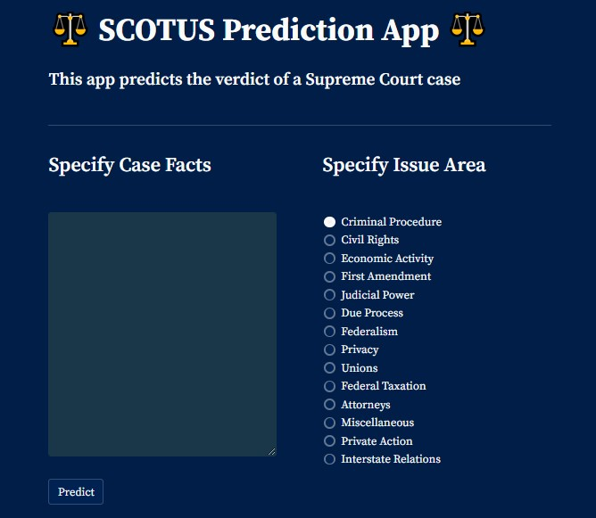

# The Supreme Court Of The United States (SCOTUS)


Understanding the judicial decision-making process may be aided by the ability to predict the results of legal matters. In light of this, we trained a model that can predict and classify the court's decision given the case's information from the plaintiff and the defendant in textual format. This was achieved by using powerful NLP algorithms to evaluate past court cases. As a result, by producing a verdict, the model is simulating a human jury. 

Overall, this solution can be utilized to speed up judicial decision-making and lighten the load on judges.

# Libraries used

For the project the following Python libraries for Data Science and Machine Learning were used:
| Package | Function |
|---------|----------|
| numpy | For scientific computation |
| pandas | For data manipulation |
| matplotlib | For visualization |
| seaborn | For visualization |
| tensorflow | For building neural networks |
| nltk | For text preprocessing |
| sklearn | For machine learning |
| wordcloud | For creating wordclouds |
| spacy | For lemmatization |
| streamlit | For application development |

# Methodology



# About the dataset

### Source

The dataset used was obtained from [Kaggle](https://www.kaggle.com/datasets/deepcontractor/supreme-court-judgment-prediction).
The dataset contains 3304 cases from the Supreme Court of the United States from 1955 to 2021. Each case has the case's identifiers as well as the facts of the case and the decision outcome.

Target Variable: First_Party_Winner, if true means that the first party won, and if false it means that the second party won.

### Features

- `ID`: Unique case identifier 
- `name`: The name of the case
- `href`: The Oyez’s API URL for the case 
- `docket`: A special identifier of the case used by the legal system
- `term`: The year when the Court received the case
- `first_party`: The name of the first party (petitioner)
- `second_part`: The name of the second party (respondent)
- `facts`: The absolute, neutral facts of the case written by the court clerk
- `facts_len`: The number of justices voting for the majority opinion
- `majority_vote`: The number of justices voting for the majority opinion
- `minority_vote`: The number of justices voting for the minority opinion
- `first_party_winner`: True if the first party won the case, otherwise False and the second party won the case
- `decision_type`: The type of the decision decided by the court, e.g.: per curiam, equally divided,opinion of the court
- `disposition`: The treatment the Supreme Court accorded the court whose decision it reviewed;e.g.: affirmed, reversed, vacated
- `issue_area`: The pre-defined legal issue category of the case; e.g.: Civil Rights, CriminalProcedure, Federal Taxation

# Modeling - Long Short-Term Memory (LSTM)

LSTM is a type of **Recurrent Neural Network** (RNN) with higher memory power to remember the outputs of each node for a more extended period to produce the outcome for the next node efficiently.

LSTM basically allows a neural network to remember the things that it needs to keep hold of context but also to forget the things that are no longer applicable.

### LSTM structure

Traditional RNN suffers from what is known as the long-term dependency problem. That is, over time, as more and more information piles up, RNN becomes less effective.

<figure>
    
    <figcaption>Basic RNN. <em>Source</em>: <a href="https://colah.github.io/posts/2015-08-Understanding-LSTMs/">Click here for reference</a></figcaption>
</figure>

LSTM provides a solution to this long-term dependency by adding an internal state to the RNN node. This state is a cell that consists of three parts refered to as **_gates_**, namely:

- Forget gate
- Input gate
- Output gate

<figure>
    
    <figcaption>LSTM. <em>Source</em>: <a href="https://colah.github.io/posts/2015-08-Understanding-LSTMs/">Click here for reference</a></figcaption>
</figure>

### LSTM architecture

```
model = Sequential()
model.add(Embedding(n_unique_words, 128, input_length=maxlen))
model.add(Bidirectional(LSTM(64)))
model.add(Dropout(0.2))
model.add(Dense(128, activation='relu'))
model.add(Dense(256, activation='relu'))
model.add(Dense(128, activation='relu'))
model.add(Dense(1, activation='softmax'))
model.compile(loss='binary_crossentropy', optimizer='adamax', metrics=['accuracy'])
```

### Model optimization

RMSProp, AdaDelta and Adam are very similar algorithms. However, Adam has been found to slightly outperform RMSProp and is generally chosen as the best overall choice. For this reason we employed Adamax as our optimizer which is even better than Ada. [Click here for reference](https://keras.io/api/optimizers/adamax/)

# Model Evaluation

The prediction of outcome is seen as a binary classification problem. Hence, **_accuracy_** was employed as the performance metric.

After tuning network parameters and training the LSTM network for 150 epochs, it achieved 65.32% accuracy on the test set.




# Model User Interface with Streamlit

Streamlit is a free, open-source,  Python framework that makes it simple for data scientists to develop machine learning web applications.

To get started with streamlit, run the following in the terminal:

```
pip install streamlit
```

To build a UI, run the following in a Python script (e.g. **`app.py`**):

```
import streamlit as st


st.title("This is a sample application")
st.divider()
st.text_area("", height=200)
st.button("Predict")
```

To start the application server, run the following in the terminal:

```
streamlit run app.py
```

The default browser will open a new tab and the web app will be served on that tab. Below is a picture of our streamlit web application:



The hypothetical legal practitioner will enter facts details and also specify what issue area the case falls under and click the **Predict** button after. The app will then collect these input features on which the model has been trained on and return a model prediction output on the screen.

## Contributors ✨

- Ode, Christopher
- Nnaji, Maryann
- Ugwu, Chinyere
- Anene, Chukwunenye
- Sule, Muhammad Abba
- Owolabi, timilehin
- Bankole, Moses Olamilekan
- Dan-Ekeh, Izundu

